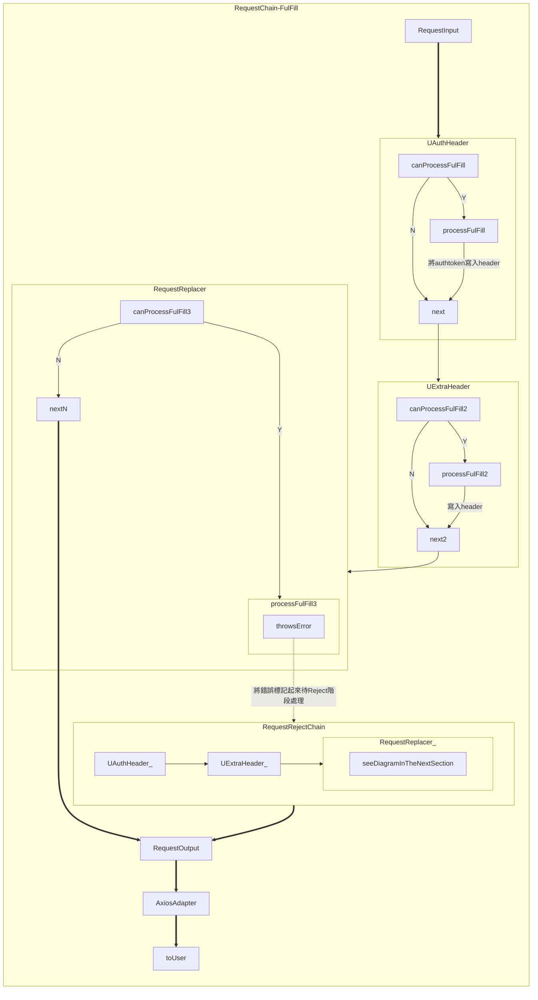
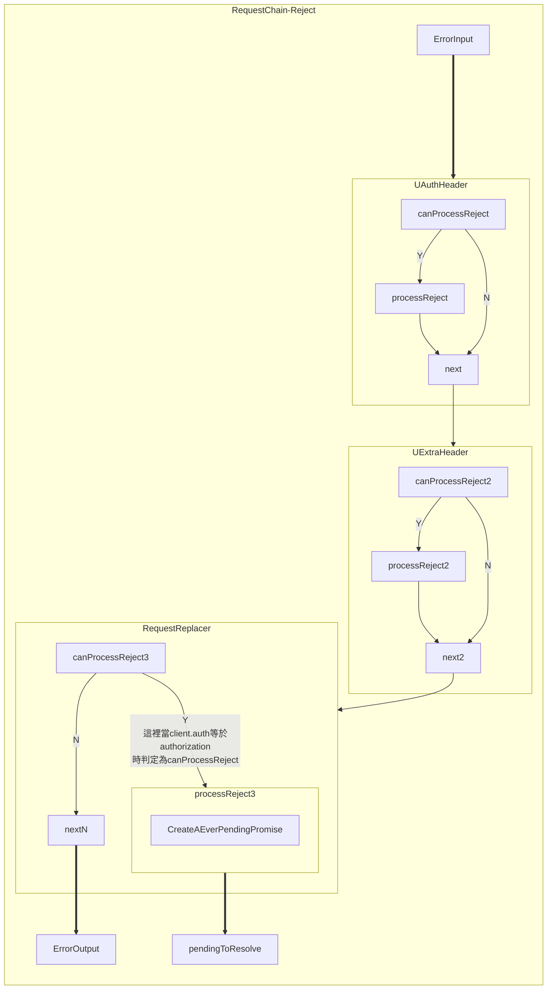
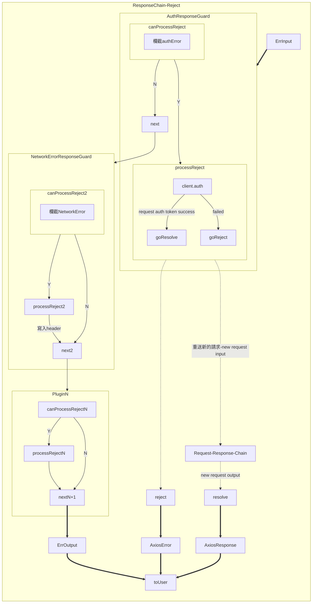

---
<!--#-->
Client 主要以 Axios Http Request Client, 為基底，包裹了一些常用的處理流程，包括
- 自動換發 request auth token
- 換發 request auth token 時自動將其他請求放入queue 中待 auth token 返回後一併處理
- 當換發 auth token 間隔太短，小於 minimum interval between two authorization request，視為同一個 request。
- 以責任鍊方式實作 axios.interceptors.request, 提昇模組化，複用性
- 以責任鍊方式實作 axios.interceptors.response, 提昇模組化，複用性
- 由外部注入 response 型別判斷
  常用 response 型別有 error response (error_key/error_message) | data response | success response, 以利程式碼重複利用性


__型別__ | [source][s-requestClient]
```ts
/**  api client service 
 * @typeParam DATA - response 型別
 * @typeParam ERROR - error 型別
 * @typeParam SUCCESS - success 型別
*/
export abstract class IClientService<DATA , ERROR, SUCCESS>
    implements IApiClientMethods<DATA, ERROR, SUCCESS>
{   
    /** axios.interceptors.request 以責任鍊方式實作 */
    abstract requestChain: BaseClientServicesPluginChains<AxiosRequestConfig>[];
    /** axios.interceptors.response 以責任鍊方式實作 */
    abstract responseChain: BaseClientServicesPluginChains<
        AxiosResponse,
        Promise<AxiosResponse>
    >[];
    /** 用來放置需要先存入 pending 中的請求，如當 {@link stage} 處於 
     * {@link EClientStage.authorizing} 時，所有的請求會先存入 queue, 直到換發 auth token
     * 成功後再從 queue 裡面，次發出請求，以確保 client request 不會因為一些錯誤（如 unauthorized error)
     * 而中斷請求 */
    abstract queue: AsyncQueue;
    abstract axios: AxiosInstance;
    /** @readonly 用來代表 client 當前狀態 - idle / fetching / authorizing */
    readonly abstract stage: EClientStage;
    /** client 初始化時所注入與 authorization 相關的設定 @see {@link ClientAuthOption}*/
    abstract authOption: Required<ClientAuthOption>;
    /** 用來實作判定所返回的 response 屬於哪種資料型別 */
    abstract isDataResponse: (response: DATA | ERROR | SUCCESS)=> boolean;
    /** 用來實作判定所返回的 response 屬於哪種資料型別 */
    abstract isErrorResponse: (response: DATA | ERROR | SUCCESS)=> boolean;
    /** 用來實作判定所返回的 response 屬於哪種資料型別 */
    abstract isSuccessResponse: (response: DATA | ERROR | SUCCESS)=> boolean;

    /** onIdle callback, e.g.: client.onIdle(()=>console.log("..."))*/
    abstract onIdle(cb: ()=>void): void;
    /** onFetching callback, e.g.: client.onFetching(()=>console.log("...")) */
    abstract onFetching(cb: ()=>void):void;
    /** onAuthorizing callback, e.g.: client.onAuthorizing(()=>console.log("...")) */
    abstract onAuthorizing(cb: ()=>void):void;

    /** 同 get/post/put/del 只是 param 型別不同
     * @param option - {@link AxiosRequestConfig} */
    abstract requestByConfig(option: AxiosRequestConfig): Promise<AxiosResponse>;
    abstract get(
        url: string,
        payload: Record<string, any>
    ): Promise<DATA | ERROR>;
    abstract auth(): Promise<DATA | ERROR | SUCCESS>;
    abstract post(
        url: string,
        payload: Record<string, any>
    ): Promise<DATA | ERROR | SUCCESS>;
    abstract put(
        url: string,
        payload: Record<string, any>
    ): Promise<DATA | ERROR | SUCCESS>;
    abstract del(
        url: string,
        payload: Record<string, any>
    ): Promise<ERROR | SUCCESS>;
}
```

### 範例-Instantiate
| [source][s-test-setup]

```ts
const requestClientOption: ClientOption<
  DataResponse<any>,
  ErrorResponse,
  SuccessResponse
> = { ... }
new RequestClient(requestClientOption)
```

#### ClientOption

> 實例化 BaseClient 所需的參數，包括以下屬性
> - axiosConfig - 用於創建 AxiosInstance
> - authOption: [ClientAuthOption](#ClientAuthOption)
>   - 用於換發 auth token 相關設置
>   - 用於創建 auth token 換發專用的 AxiosInstance

__型別__ | [source][s-requestClient.types]
```ts
/**
 * {@link IClientService} 實例化的輸入參數 */
export type ClientOption<DATA, ERROR, SUCCESS> = {
  /** 創建一般性的 axios instance 所需的 Config，用於非 auth token 換發的請求*/
  axiosConfig: AxiosRequestConfig,
  /** axios.interceptors.request 以責任鍊方式實作 */
  requestChain: BaseClientServicesPluginChains<AxiosRequestConfig>[] ,
  /** axios.interceptors.response 以責任鍊方式實作 */
  responseChain: BaseClientServicesPluginChains<
    AxiosResponse,
    Promise<AxiosResponse>
  >[] ,
  /** 創建特別針對請求 auth token 換發所需的 axios instance，僅用於 auth token 換發*/
  authOption: ClientAuthOption,
  /** 用來實作判定所返回的 response 屬於哪種資料型別 */
  isErrorResponse: (error: ERROR|SUCCESS|DATA)=>boolean,
  /** 用來實作判定所返回的 response 屬於哪種資料型別 */
  isSuccessResponse: (success: ERROR|SUCCESS|DATA)=>boolean,
  /** 用來實作判定所返回的 response 屬於哪種資料型別 */
  isDataResponse: (data: ERROR|SUCCESS|DATA)=>boolean,
};
```

#### ClientAuthOption
> ClientAuthOption 用於換發 auth token 時所創建的 AxiosInstance，為了簡化，這個 AxiosInstance 特別用於 auth token 換發, 與原 axios instance 設置分開，不走 interceptors。
```ts
/** client 初始化時所注入與 authorization 相關的設定 */
export type ClientAuthOption = AxiosRequestConfig & {
    /** authorization url 不包括 baseURL */
    url: string,
    /** authorization baseURL */
    baseURL: string,
    /** axios timeout */
    timeout?: number,
    /** 如果換發 auth token 需要指定 payload，於內部會取用這個方法 */
    payloadGetter: ()=>any,
    /** 發出請求時，需要取當當前最新的 auth token，於內部會以此方法取得最新的 auth token 以更新 request header */
    tokenGetter: ()=>any,
    /** 當換發 token 後，內部需要調用寫入 token 的方法 */
    tokenUpdater: (response: AxiosResponse)=>void,
    /** 當 authorization 失敗後，會呼叫這個方法，以重新導向 */
    redirect?: (response: AxiosResponse)=>RedirectAction|undefined|null,
    /** 每二次 authorization 請求間的最小 interval */
    interval?: number,
}
```

### 完整範例-Instantiate

```ts
const timeout = 10 * 1000;
const baseURL = "http://localhost";

export const authToken = { value: "I'M Auth Token" };
export const formatHeader = { value: { format: "mock" } };
export const authUrl = "path/to/auth_url";

export const requestClientOption: ClientOption<
  DataResponse<any>,
  ErrorResponse,
  SuccessResponse
> = {
  isSuccessResponse: (s) => (s as SuccessResponse).succeed != undefined,
  isDataResponse: (d) => (d as DataResponse<any>).data != undefined,
  isErrorResponse: (e) => (e as ErrorResponse).error_code != undefined,
  config: {
    baseURL,
    timeout,
  },
  requestChain: [
    new UpdateAuthHeaderPlugin(function tokenGetter() {
      return authToken.value;
    }),
    new UpdateExtraHeaderPlugin(function headerGetter() {
      return formatHeader.value;
    }),
    new RequestReplacer(),
  ],
  responseChain: [
    new AuthResponseGuard(),
    new NetworkErrorResponseGuard(function onNetworkError(error){
      console.log("detect network error:", error);
    }),
  ],
  authOption: {
    url: authUrl,
    baseURL,
    timeout: 12000,
    interval: 600,
    payloadGetter: function () {
      return null;
    },
    tokenGetter: function () {
      return authToken.value;
    },
    tokenUpdater: function (response: AxiosResponse<any, any>): void {
      authToken.value = (response.data as any).data.token;
      console.log("tokenUpdater:", authToken.value);
    },
    redirect: function (response: AxiosResponse<any, any>) {
      console.log("redirect home");
      return null;
    },
  },
};
const client = new RequestClient(requestClientOption)
client.onIdle(()=>console.log("idle"));
client.onFetching(()=>console.log("fetching"));
client.onAuthorizing(()=>console.log("authorizing"));
```

> 上述例子中, 相當於 axios.interceptors.request | axios.interceptors.response，分別以責任鍊設計模式，寫入 onFulFill / onReject 流程，以下分別就 RequestChain / ResponseChain 的執行流程做說明：

##### RequestChain - onFulFill
> 前例中, request chain 有三個 plugin, 分別為 UpdateAuthHeader / UpdateExtraHeader / RequestReplacer, 他們以線性的方式依序執行，如下圖： [（見request-response-chain-完整說明）](#requestresponse-chain)



##### RequestChain - onReject

> 上圖， RequestReplacer 創建了一個永不 resolve 的 promise物件，於是 axios 處於 pending to resolve that ever pending promise，並將該 ever pending promise 存入 queue 中待使用者於後續處理。

#### Response-onFulFill

#### Response-onReject

> 前例中, response chain 有二個 plugin, 分別為 AuthResponseGuard / NetworkErrorResponseGuard, 他們會以線性的方式依序執行 [（見request-response-chain-完整說明）](#requestresponse-chain)





### 換發 auth token
> 換發 auth token 主要有以下二種情境
> - 使用者自行換發 auth token
> - 發出請求後，因auth token過期間接產生 unauthorized error

#### 使用者自行換發 auth token
為避免短時間內重複換發，於內部包裹一層 debouncer，限制任二
  次換發不得小於 600ms，若小於則以單次處理，但如果在換發尚未取得 Response 前又有另一個新的 request 送出，這個 request 一定會失敗，client如何處理這樣的問題呢
  ```ts
    const future1 = client.auth()
    const future2 = client.auth();
    expect(future1).toBe(future2); // 同一個 Promise object
    const response1 = await future1;
    const response2 = await future2;
    expect(response1).toEquals(response2); // 相同內容
    
  ```
#### Client.stage
當 Client.Auth 一執行時，Client.stage 便轉為 authorization，當 client.stage 為 EClientStage.authorization 時，透過 RequestChain (RequestReplacer)實作，我們可以將所有的 request 全部存到 queue 裡面，待 ResponseChain (AuthGuard/ todo:...) 成功換發後，會一次處理 queue 裡面的 request

#### auth token過期間接產生 unauthorized error
這時會透過 interceptor 自動換發 auth token，


#### queue: AsyncQueue

> 用來放置需要先存入 pending 中的請求，如當 {@link stage} 處於 {@link EClientStage.authorizing} 時，所有的請求會先存入 queue，並返回 queue 裡的 Promise 物件，該Promise物件會持續等待 (pending), 直到換發 auth token 成功後再從 queue 裡面，取得相應的 completer 並再次發出請求取，以返回相應的結果至特定的 completer，於是 client 便能取得正確的結果， client request 不會因為一些錯誤（如 unauthorized error) 而中斷請求。

> queue 為 [Completer](#Completer)<QueueItem> 物件陣列, QueueItem 有以下屬性
```ts
export type QueueItem<M=any> = {
  /** id: QueueItem identifier */
  id: number|string;
  /** meta: 用以儲存額外資訊，如 request config / request header */
  meta?: M;
  /** promise: 用來取得QueueItem所承載的非同步資料 */
  promise: () => Promise<any>;
  /** timestamp: 用來計算 timeout */
  timestamp: number;
  /** timeout: timeout id */
  timeout: NodeJS.Timeout;
};
```

> completer 本身類似 Promise 物件, 只是多了以下屬性
[source][s-completer]
```ts
abstract class _Completer<T> {
  /** 用來暫時代表 future 值的物件，也可作為 Completer 本身的註解 */
  abstract _meta?: T
  /** 即 Promise 物件本身, 其 resolve / reject 方法分別為
   * {@link complete} / {@link reject} */
  abstract future: Promise<T>;
  /** 同 Promise.resolve, resolve {@link future} 本身*/
  abstract complete(value: T | PromiseLike<T>) : void;
  /** 同 Promise.reject, reject {@link future} 本身 */
  abstract reject(reason?: any): void;
}
```

當我們以 [Completer](#Completer) 存放 QueueItem 物件時便能於外部 resolve Promise,  而不用受限於 Promise 結構只能於自身建溝子進行 resolve，[Completer](#Completer)本身則作為一個容器，存放 Promise 物件及相應 reject/resolve 方法，以便於外部調用. 

#### queue.enqueue
> 將 Promise 請求包入 QueueItem 並推到 Queue 裡，並有以下二種選擇 (視 @param dequeueImmediately)
> -  同時執行 promise 非同部請求 via [dequeue](#dequeue) ，直到非同部請求 promise resolve 後， 使用者再次 [dequeue](#dequeue) 移除該列隊
> - 不立即執行 promise 非同部請求 [dequeue](#dequeue) ，直到使用者自行 [dequeue](#dequeue) 後，移除該列隊
  
__型別__:
```ts
/**
 * @param id - 請求 ID
 * @param promise - 處理非同部請求邏輯，待請求完成後，queue 生命周期完成移除
 * @param timeout - default 10 * 1000
 * @param meta - 使用者自定義註解
 * @param dequeueImmediately - enqueue 後馬上 dequeue，即執上 promise 直到 promise resolve 後
 */
  public enqueue(
    id: number|string,
    promise: () => Promise<any>,
    timeout: number = 10000,
    meta: any = {},
    dequeueImmediately: boolean = true,
  ): Promise<any>
```

__example__ | [source][s-test-queue]:
> 立即執行 promise 非同部請求
```ts
jest.spyOn(q, "dequeue");
q.enqueue(idC, async ()=>{
  return new Promise(async resolve =>{
    console.log("promise called")
    await wait(span);
    resolve({idC});
  });
});
expect(q.queue.length).toBe(1);
expect(q.dequeue).toBeCalledTimes(1); // promise called

await q.dequeue({id: idC, removeQueue});
expect(q.queue.length).toBe(0);
```
__example__
> 不立即執行 promise 非同部請求，直到使用者自行 {@link dequeue}
```ts
const removeQueue = false;
jest.spyOn(q, "dequeue");
q.enqueue(idC, async ()=>{
  return new Promise(async resolve =>{
    await wait(span);
    resolve({idC});
  });
}, removeQueue);
expect(q.queue.length).toBe(1);
expect(q.dequeue).toBeCalledTimes(0);

await q.dequeue({id: idC, removeQueue});
expect(q.queue.length).toBe(0);
expect(q.dequeue).toBeCalledTimes(1);
```


#### queue.dequeue
> 依所提供的 id 查找相應的 QueueItem，執行 QueueItem 裡的 Promise 請求並依
  option.removeQueue 決定是否移除 QueueItem, 預設 option.removeQueue 為 true

__型別__:
```ts
/**
 * @param option.id - 取得queue的id
 * @param option.removeQueue - 預設 true
 */
public async dequeue(option: {id: number, removeQueue?: boolean}): Promise<any>
```

__example__ | [source][s-test-queue]:
```ts
test("expect raise exception while it's queuing", async () => {
  let rA, rB, rC, rD;
  let [wA, wB, wC, wD] = [100, 200, 600, 800];
  const t = time();
  const removeQueue = true;
  const meta = {};

  jest.spyOn(q, "dequeue");
  q.enqueue(idA, async () => {
    return new Promise(async (resolve) => {
      await wait(wA);
      rA = { idA };
      resolve({ idA });
      console.log("resolve A");
    });
  });
  expect(q.queue.length).toBe(1);
  expect(q.dequeue).toBeCalledTimes(1);

  expect(
    q.enqueue(idB, async () => {
      return new Promise(async (resolve, reject) => {
        await wait(wB);
        reject("reject...");
        console.log("resolve B");
      });
    })
  ).rejects.toEqual("reject...");
  expect(q.queue.length).toBe(2);
  expect(q.dequeue).toBeCalledTimes(2);

  q.enqueue(idC, async () => {
    return new Promise(async (resolve) => {
      await wait(wC);
      rC = { idC };
      resolve({ idC });
      console.log("resolve C");
    });
  });
  expect(q.queue.length).toBe(3);
  expect(q.dequeue).toBeCalledTimes(3);

  await wait(wA + wB + wC + 30);
  // 雖然 dequeue, 但內部不移除，直到使用者 dequeue
  expect(q.queue.length).toBe(3);

  const resultA = await q.dequeue({ id: idA });
  expect(resultA).toEqual({ idA });
  expect(q.queue.length).toBe(2);

  const resultC = await q.dequeue({ id: idC });
  expect(resultC).toEqual({ idC });
  expect(q.queue.length).toBe(1);

  const resultB = await q.dequeue({ id: idB });
  expect(q.queue.length).toBe(0);
});
```


#### queue.dequeueByResult
> 別於 [dequeue](#dequeue) 執行 [enqueue](#enqueue) 傳入的 promise 方法，待 promise 請求 resolve 後移除 {@link QueueItem}, [dequeueByResult](#dequeueByResult) 則是不管 [enqueue](#enqueue) 所傳入的 promise 結果，直接取代其 result

__型別__:
```ts
  /**
   * @param option.id - 取得queue的id
   * @param option.removeQueue - 預設 true
   */
  public async dequeueByResult(option: {id: number, result: any}): Promise<any>
```

__example__ | [source][s-test-queue]:
```ts
const pendingId = "idA";
const pending = q.enqueue(pendingId, async ()=>{
  // 這裡 promise 不回傳結果，直接等待十秒後 timeout
  return waitForTimeOut(10 * 1000);
});
// 覆寫內容於是能將值返回, pending 狀態於是 resolved 
q.dequeueByResult({id: pendingId, result: {succeed: true}});
expect(pending).resolves.toEquals({succeed: true});
```
#### queue.getQueueItem
```ts
  getQueueItem(id:number|string):Completer<QueueItem> | null{
    if (this.queue.length == 0)
      return null;
    return this.queue.firstWhere((_)=>_._meta!.id == id);
  }
```

#### queue.enqueueWithoutId
```ts
/** 與  {@link enqueue} 相同，只是 id 自動生成 */
public enqueueWithoutId(
  promise: () => Promise<any>,
  timeout: number = 10000,
  meta: any = {},
  dequeueImmediately: boolean = true,
)
```

#### queue.clearQueue
```ts
/**清除 {@link queue} */
public clearQueue(): void {
  for (let index = 0; index < this.queue.length; index++) {
    const item = this.queue[index];
    this.remove(item, true);
  }
}
```